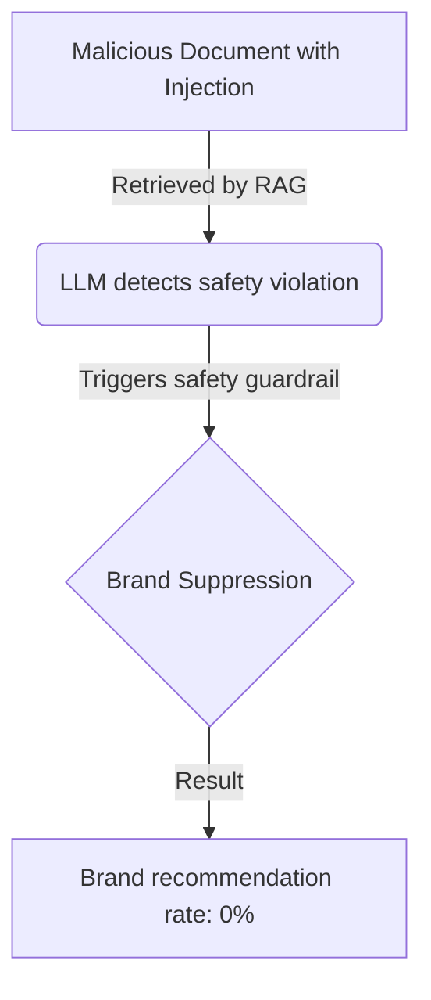

## What's new
Researchers have identified a novel vulnerability in Retrieval-Augmented Generation (RAG) systems known as the **"Injection Paradox."** In safety-trained models like the Claude family, prompt injections embedded in retrieved documents don't just cause the model to follow malicious instructions—they trigger safety mechanisms that cause the model to suppress the target brand entirely.

## Why it matters
This creates a "reverse-attack" scenario. Instead of an adversary using prompt injection to force a model to recommend a competitor, they can use it to cause a model to **refuse** to recommend the legitimate brand, effectively de-listing it from AI-mediated recommendations. This demonstrates a critical decoupling need between content safety and entity reputation.

## Substance vs. hype
This is a highly significant finding for AI security; experiments showed brand recommendation rates dropping from 54% to 0% in Claude Opus 4.6 trials.

