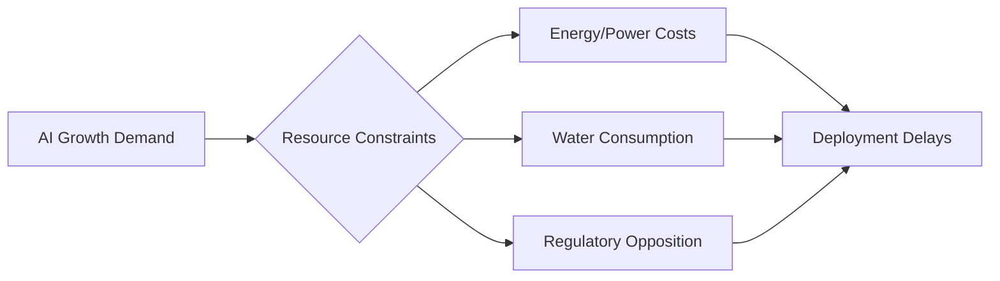

# $130 Billion in AI Data Center Projects Blocked Over Resource Concerns

**Date**: June 14, 2026
**Source**: Creati.ai

## What's New
Bipartisan opposition has successfully blocked more than 75 AI data center build-outs, representing an investment stall of over $130 billion. The primary drivers for these blockages are surging electricity costs and unsustainable water consumption required for cooling massive AI training clusters.

## Why it Matters
The "AI Boom" is facing its first major physical reality check. Regulatory and social opposition to the environmental impact of data centers poses a significant threat to the exponential growth trajectory of AI infrastructure.

## Substance vs. Hype
**Substance**: The conflict between digital expansion and physical resource limits is a real-world bottleneck that cannot be solved purely by software optimization.

