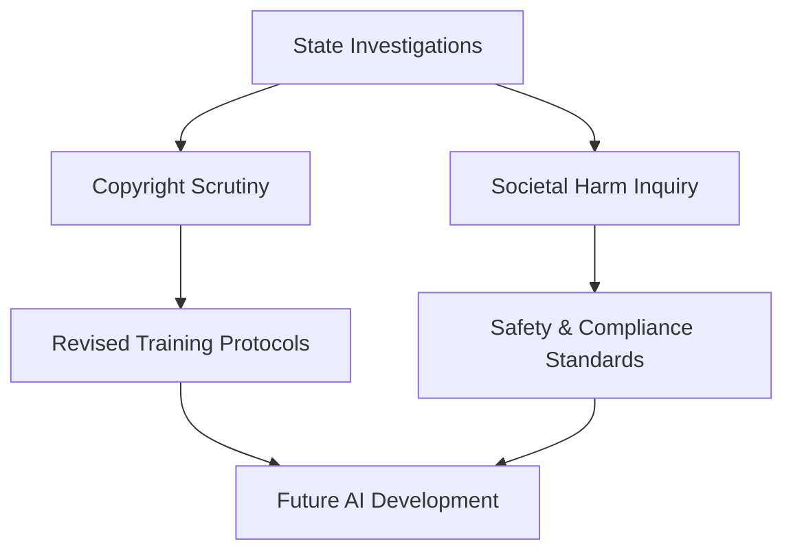

# OpenAI Faces Investigation from Multiple State Attorneys General

**Date**: June 14, 2026
**Source**: Creati.ai

## What's New
Multiple state attorneys general have launched investigations into OpenAI. The inquiries focus on potential copyright infringement and the various societal harms associated with the use of ChatGPT in public and professional sectors.

## Why it Matters
The outcome of these investigations will define the legal boundaries for generative AI. The resolution will determine how training data is sourced and how companies are held accountable for the outputs and impacts of their models.

## Substance vs. Hype
**Substance**: This marks a transition from "move fast and break things" to "comply and scale," as legal frameworks attempt to catch up with generative capabilities.

