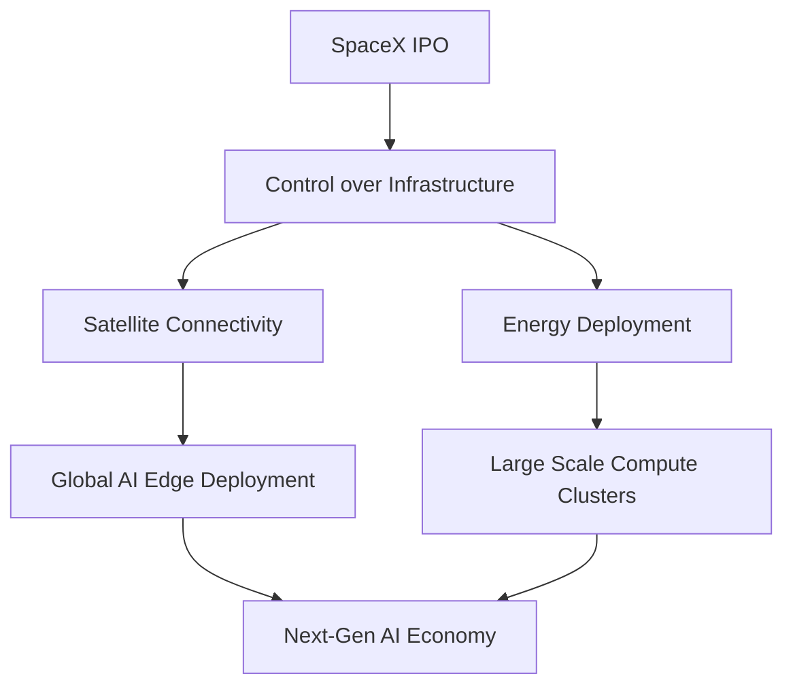

# SpaceX IPO Signals Escalating Battle for AI Infrastructure Dominance

**Date**: June 14, 2026
**Source**: Creati.ai

## What's New
SpaceX's historic IPO has ignited a fierce debate over the control of physical infrastructure underpinning the next generation of artificial intelligence. As compute demands soar, the battle for dominance has shifted from pure model training to the physical layers of energy and launch-based connectivity, with Elon Musk's xAI positioned at the epicenter of this vertical integration.

## Why it Matters
The scalability of frontier AI models is no longer just a matter of algorithmic efficiency; it is increasingly a matter of physical resource sovereignty. Control over launch capabilities, satellite-based data links, and massive-scale power deployment is becoming the primary moat for the leading AI labs.

## Substance vs. Hype
**Substance**: This is a fundamental shift in the AI industry. The convergence of aerospace, energy, and compute represents a structural change in how AI capacity is deployed.

