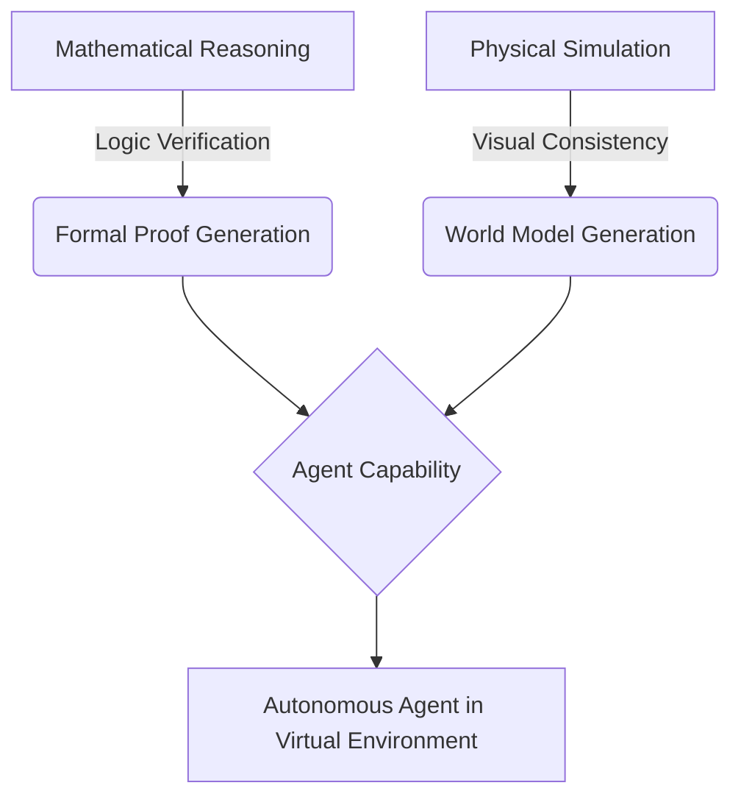

# The Era of Autonomous Reasoning & World Models

**Date:** June 15, 2026  
**Source:** AI Research Intelligence Hub  
**Category:** Deep Tech

## What's New
The landscape of artificial intelligence has seen two monumental leaps in the last 24 hours, demonstrating a convergence between pure symbolic reasoning and physical world simulation. 

1. **OpenAI's Mathematical Discovery:** A reasoning model has solved the "planar unit distance problem," a long-standing conjecture in discrete geometry.
2. **DeepMind's Genie 3:** A foundation world model capable of generating interactive, high-resolution 3D environments from text prompts.

## Why it Matters
We are witnessing the transition from LLMs that "predict text" to models that "understand logic" and "simulate reality." The ability of AI to solve mathematical conjectures suggests a leap in formal logic capability, while world models like Genie 3 provide the training ground for robots and agents to learn through interaction rather than static datasets.

## Substance vs. Hype
Unlike recent "chatbot" breakthroughs, these developments represent fundamental shifts in model architecture—specifically in the intersection of algebraic number theory application and high-frequency physical simulation. This is not just better chat; it is the foundation for autonomous scientific discovery and interactive digital realities.

## Technical Workflow: Reasoning to Simulation

***
*Generated by SynapseDigest Agentic Workflow*
